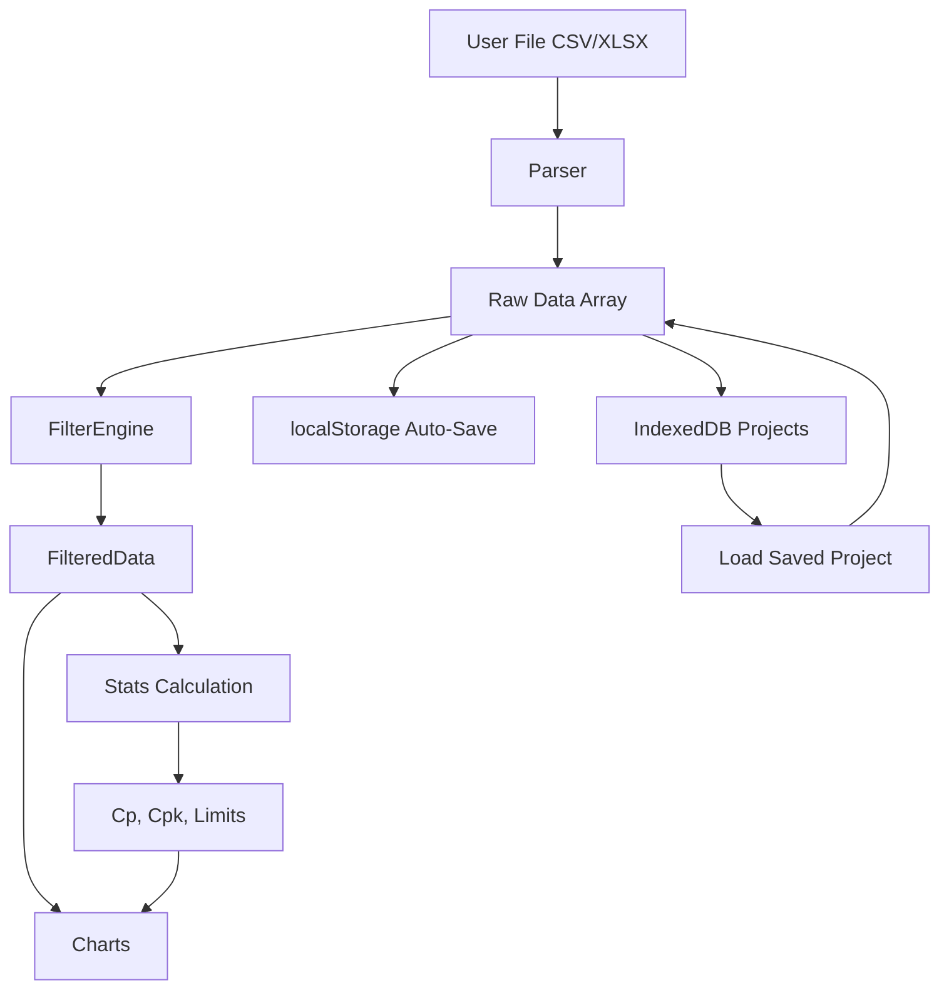

# AI Context & Mental Model

## Architecture Overview
VariScout Lite is a Progressive Web App (PWA) that runs entirely in the browser. It deliberately eschews a complex backend in favor of a "thick client" approach where all data processing happens in the browser using pure JavaScript/TypeScript.

### "No Backend" Philosophy
- There is no database server.
- Data is loaded into memory from files selected by the user.
- State persists in browser storage (localStorage for auto-save, IndexedDB for named projects).
- "Saving" an analysis means either storing to IndexedDB or serializing to a JSON file (`.vrs`) that the user downloads.

### PWA Benefits
- **Offline-first**: Works without internet after first visit (Service Worker caches all assets)
- **Installable**: Users can "Add to Home Screen" on mobile or install via browser on desktop
- **Cross-platform**: Works on phones, tablets, and desktops
- **No app store**: Direct URL access, no installation friction

## Core Domain Concepts

### 1. The "Outcome" vs "Factor"
- **Outcome**: The continuous variable being measured (e.g., "Weight", "Diameter", "Moisture"). Used for the Y-axis of I-Charts and Boxplots.
- **Factor**: Categorical variables (e.g., "Machine ID", "Operator", "Shift"). Used for grouping in Boxplots and Paretos.

### 2. The Dashboard Layout
The app revolves around a single dense view:
- Top: **I-Chart** (Timeline view of the Outcome)
- Bottom Left: **Boxplot** (Outcome split by a selected Factor)
- Bottom Right: **Pareto** (Counts of a categorical Factor or "Defect Code")

### 3. Linked Filtering (The "Magic")
- **Brushing** the I-Chart sets a `timeRange` filter.
- **Clicking** a Boxplot whisker sets a `factorValue` filter.
- **Clicking** a Pareto bar sets a `category` filter.
- **ALL** charts must react to **ALL** filters immediately.

## Data Flow

## Persistence Layer

### Auto-Save (localStorage)
- Saves current session state every second (debounced)
- Restores automatically on page load
- Provides crash recovery

### Named Projects (IndexedDB)
- User can save multiple analyses with names
- Supports larger datasets than localStorage
- CRUD operations: save, load, list, rename, delete

### File Export/Import (.vrs)
- Download as JSON for sharing/backup
- Upload to restore on different device/browser

## Critical Implementation Details
- **Visx**: We use low-level Visx primitives, not high-level abstractions, to ensure performance and exact styling control.
- **Auto-Scale**: Charts must auto-scale y-axes dynamically based on filtered data.
- **Color Coding**:
    - **Green/Red**: Typically reserved for Spec compliance (Pass/Fail).
    - **Gray**: Contextual data or unselected items.
- **Mobile-First**: UI is responsive with touch-friendly interactions for factory floor tablets.
