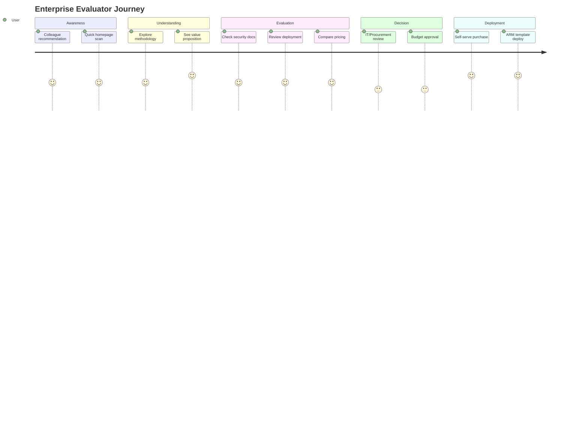
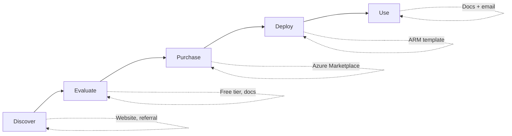

# Flow 4: Enterprise Evaluator

> OpEx Olivia evaluates VaRiScout for her team via self-serve journey
>
> **Priority:** Medium - self-serve, documentation-first
>
> See also: [Journeys Overview](../index.md) for site architecture

---

## Persona: OpEx Olivia

| Attribute         | Detail                                             |
| ----------------- | -------------------------------------------------- |
| **Role**          | OpEx Manager                                       |
| **Goal**          | Find tools for team                                |
| **Knowledge**     | Strategic, evaluates ROI                           |
| **Pain points**   | Budget constraints, IT approval, change management |
| **Entry points**  | Referral from colleague, LinkedIn, conference      |
| **Decision mode** | Needs security docs, deployment guide, pricing     |

### What Olivia is thinking:

- "My team needs better analysis tools"
- "Can I justify the cost vs Minitab?"
- "What's the IT/security story?"
- "How hard is deployment?"

---

## Entry Points

| Source              | Arrives Via         | Lands On       |
| ------------------- | ------------------- | -------------- |
| Colleague referral  | Direct link         | / or /products |
| Conference          | QR code / card      | /              |
| LinkedIn            | Company page / post | / or /products |
| Team member request | "Check this out"    | /products      |

---

## Journey Flow

### Mermaid Flowchart

```mermaid
flowchart TD
    A[Referral from colleague<br/>or conference] --> B[Homepage<br/>What is this? Who is it for?]
    B --> C{Path Choice}
    C -->|Learn more| D[/journey<br/>See methodology]
    C -->|Direct| E[/products]
    D --> F[I get it - now eval for team]
    F --> E
    E --> G[/products/enterprise]
    G --> H{Evaluation Questions}
    H -->|SSO/Security?| I[Documentation]
    H -->|Data hosting?| J[Your Azure, your data]
    H -->|Deployment?| K[1-click ARM template]
    H -->|Need help?| L[Your consultants can assist]
    I --> M{Decision}
    J --> M
    K --> M
    L --> M
    M -->|Self-serve| N[Purchase online + Deploy]
    M -->|Assisted| O[Consultant deployment]
```

### Enterprise Evaluation Journey



### Self-Serve Model



### ASCII Reference

```
┌─────────────────┐
│ Referral from   │
│ colleague or    │
│ conference      │
└────────┬────────┘
         │
         ▼
┌─────────────────┐
│ / (Homepage)    │
│                 │
│ Quick scan:     │
│ "What is this?" │
│ "Who is it for?"│
└────────┬────────┘
         │
    ┌────┴────────────┐
    │                 │
    ▼                 ▼
┌────────────┐  ┌────────────┐
│ /journey   │  │ /products  │
│            │  │            │
│ See the    │  │ Jump to    │
│ methodology│  │ enterprise │
└─────┬──────┘  └─────┬──────┘
      │               │
      ▼               │
┌────────────┐        │
│ "I get it" │        │
│            │        │
│ Now eval   │        │
│ for team   │────────┘
└─────┬──────┘
      │
      ▼
┌─────────────────┐
│ /products/      │
│ enterprise      │
│                 │
│ Features        │
│ Security docs   │
│ Deployment guide│
│ Pricing         │
└────────┬────────┘
      │
      ▼
┌─────────────────┐
│ Questions:      │
│                 │
│ • SSO/Security? │ → Documentation
│ • Data hosting? │ → "Your Azure, your data"
│ • Deployment?   │ → 1-click ARM template
│ • Need help?    │ → Your LSS/IT consultants can assist
└────────┬────────┘
      │
 ┌────┴────────────────┐
 │                     │
 ▼                     ▼
┌────────────┐  ┌─────────────────┐
│ SELF-SERVE │  │ NEED HELP?      │
│            │  │                 │
│ Purchase   │  │ Your existing   │
│ online     │  │ consultants     │
│ Deploy     │  │ can deploy it   │
└────────────┘  └─────────────────┘
```

---

## Enterprise Page Requirements

The /products/enterprise page must answer:

### 1. Security & Compliance

- Where is data stored? → "Your Azure tenant, your data"
- SSO support? → Azure AD / Microsoft Entra ID
- Compliance? → SOC 2 considerations, GDPR
- Audit logs? → Azure native logging

### 2. Deployment

- How to deploy? → 1-click ARM template
- Time to deploy? → Under 1 hour
- Who deploys? → Your IT team or consultant
- Updates? → Automatic via Azure

### 3. Pricing

- Transparent pricing online
- Per-user or site license options
- No hidden fees
- Volume discounts visible

### 4. Support

- Documentation-first
- Community support (free tier)
- Email support (paid tier)
- "Your existing LSS/IT consultants can assist"

---

## Self-Serve Enterprise Model

Key principle: **No sales calls required**

| Step           | How It Works                                         |
| -------------- | ---------------------------------------------------- |
| Discover       | Website, referral, content                           |
| Evaluate       | Free tier, documentation, case studies               |
| Purchase       | Azure Marketplace (Individual/Team/Enterprise tiers) |
| Deploy         | 1-click ARM template                                 |
| Support        | Documentation + email                                |
| Implementation | Your existing consultants can help                   |

---

## CTAs on This Journey

| Location          | CTA Text                         | Destination          |
| ----------------- | -------------------------------- | -------------------- |
| Homepage          | "For Teams" or "Enterprise"      | /products/enterprise |
| Journey page      | "Deploy for your team"           | /products/enterprise |
| Products overview | "Compare options"                | /products            |
| Enterprise page   | "Deploy Now" (ARM template link) | Azure deployment     |
| Enterprise page   | "Contact for volume pricing"     | /support/contact     |
| Pricing page      | "Enterprise options"             | /products/enterprise |

---

## Information Olivia Needs

| Question                    | Answer Location         |
| --------------------------- | ----------------------- |
| What does it do?            | /journey, /tools        |
| Is it secure?               | /products/enterprise    |
| Where's my data?            | /products/enterprise    |
| How much does it cost?      | /pricing                |
| How do I deploy?            | /products/enterprise    |
| Who supports it?            | /support                |
| Can I try it first?         | /app (free tier)        |
| What training is available? | Link to RDMAIC training |

---

## Evaluator Erik (Secondary)

IT/Procurement evaluator may also be involved:

| Erik's Questions           | Answer                            |
| -------------------------- | --------------------------------- |
| Security architecture?     | Azure-native, your tenant         |
| Data residency?            | Your choice of Azure region       |
| Authentication?            | Azure AD SSO                      |
| Compliance certifications? | Azure compliance + our docs       |
| SLA?                       | Azure SLA + our support tiers     |
| Exit strategy?             | Export all data, standard formats |

---

## Mobile Considerations

- Enterprise page should work on mobile (conference scanning)
- Key info visible without deep scrolling
- Easy path to schedule demo or download docs
- QR codes on printed materials

---

## Success Metrics

| Metric                         | Target |
| ------------------------------ | ------ |
| Homepage → Enterprise page     | Track  |
| Enterprise page → Deployment   | >5%    |
| Enterprise page → Contact      | >2%    |
| ARM template downloads         | Track  |
| Time to purchase (first visit) | Track  |

---

## Gap: Enterprise Page Content Needed

Current gap identified:

The enterprise page needs:

- Full security documentation
- Deployment guide with screenshots
- Pricing calculator
- FAQ for IT/Procurement
- Customer logos / testimonials (when available)
