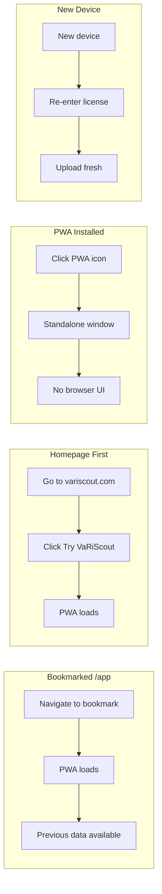
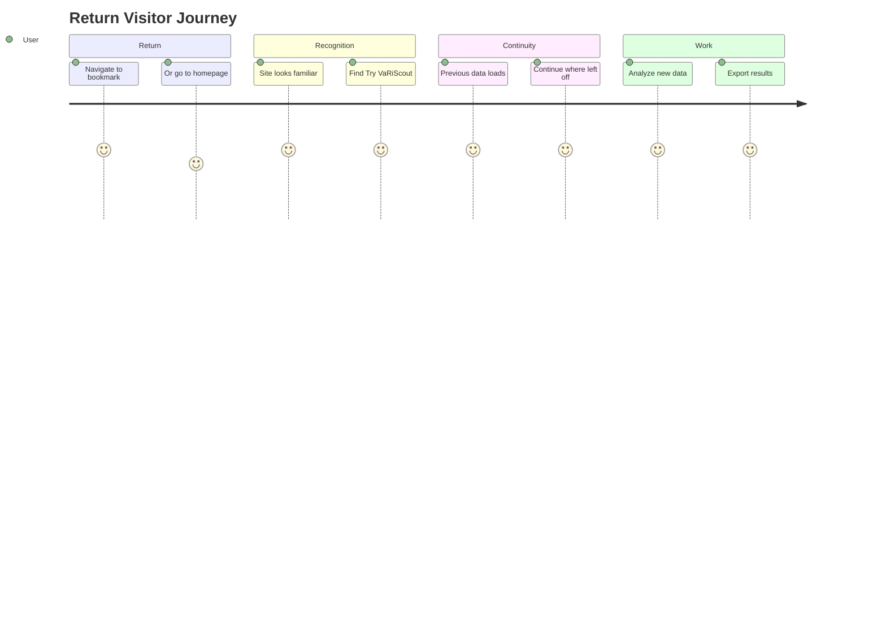

# Flow 5: Return Visitor → App

> Existing user returns to use VaRiScout
>
> **Priority:** Medium - retention/activation
>
> See also: [Journeys Overview](../index.md) for site architecture

---

## Persona: Return Visitor

| Attribute       | Detail                            |
| --------------- | --------------------------------- |
| **Role**        | Any previous user                 |
| **Goal**        | Use VaRiScout with their data     |
| **Knowledge**   | Already knows what VaRiScout is   |
| **Entry point** | Bookmark, direct URL, or homepage |
| **Need**        | Quick access, no friction         |

### What they're thinking:

- "I need to analyze this data"
- "Where's the app again?"
- "Did my previous work save?"

---

## Entry Points

| Source              | URL            | Intent          |
| ------------------- | -------------- | --------------- |
| Bookmark (ideal)    | /app           | Direct to PWA   |
| Bookmark (homepage) | /              | Navigate to app |
| Browser history     | / or /app      | Return to work  |
| PWA installed       | Standalone app | Direct launch   |

---

## Journey Flow

### Mermaid Flowchart

```mermaid
flowchart TD
    A[Direct URL or Bookmark] --> B{Entry Point}
    B -->|Direct| C[/app - PWA loads]
    B -->|Homepage| D[/ Homepage]
    D --> E[Clicks Try VaRiScout]
    E --> C
    C --> F[Previous data restored]
    F --> G{User Status}
    G -->|Free tier| H[May see upgrade prompts]
    G -->|Licensed| I[Full access]
    H --> J[Continue working]
    I --> J
```

### Return Visitor Scenarios



### User Satisfaction Journey



### ASCII Reference

```
┌─────────────────┐
│ Direct URL or   │
│ Bookmark        │
└────────┬────────┘
         │
    ┌────┴────┐
    │         │
    ▼         ▼
┌────────┐ ┌─────────────────┐
│ /app   │ │ / (Homepage)    │
│        │ │                 │
│ Direct │ │ "I know what    │
│ to PWA │ │ this is"        │
└────────┘ └────────┬────────┘
                    │
                    ▼
           ┌─────────────────┐
           │ Clicks:         │
           │                 │
           │ [Try VaRiScout] │
           └────────┬────────┘
                    │
                    ▼
           ┌─────────────────┐
           │ /app            │
           │                 │
           │ PWA loads       │
           │ Previous data   │
           │ restored        │
           └─────────────────┘
```

---

## Key Design Principles

### 1. No Login Required

VaRiScout is 100% client-side:

- License key stored in IndexedDB
- Data stored in IndexedDB
- No server-side accounts
- "We don't have your data" (GDPR simple)

### 2. Fast Access from Homepage

Header CTA always visible:

```
[Logo: VaRiScout]  Journey  Cases  Tools ▼  Learn ▼  Pricing  [Try VaRiScout]
```

Return visitors click [Try VaRiScout] → straight to /app

### 3. PWA Install Prompt

For frequent users:

- Prompt to install PWA after 2nd visit
- Installed PWA opens directly (no browser chrome)
- Works offline after initial load

---

## Data Persistence

| What's Saved      | Where           | Retention     |
| ----------------- | --------------- | ------------- |
| License key       | IndexedDB       | Until cleared |
| Uploaded datasets | IndexedDB       | Until deleted |
| Analysis settings | IndexedDB       | Per dataset   |
| Edition branding  | License-derived | N/A           |

---

## Return User Scenarios

### Scenario A: Bookmarked /app

1. User navigates to bookmark
2. PWA loads immediately
3. Previous datasets available
4. Continue working

### Scenario B: Homepage First

1. User goes to variscout.com
2. Sees familiar homepage
3. Clicks [Try VaRiScout]
4. PWA loads with previous data

### Scenario C: PWA Installed

1. User clicks PWA icon on desktop/phone
2. App opens in standalone window
3. No browser UI
4. Previous data available

### Scenario D: New Device

1. User goes to variscout.com on new device
2. Needs to re-enter license key (Settings)
3. Uploads data fresh
4. Continue working

---

## Navigation for Return Visitors

The header is the same for everyone:

```
[Logo]  Journey  Cases  Tools ▼  Learn ▼  Pricing  [Try VaRiScout]
```

But return visitors:

- Ignore most navigation
- Go straight to [Try VaRiScout]
- May check /cases for new content
- May check /pricing for upgrade

---

## Upgrade Path

For free tier users returning:

| Trigger              | Prompt                                   |
| -------------------- | ---------------------------------------- |
| Large dataset upload | "Unlock unlimited rows with Pro"         |
| Export attempt       | "Get full export with Pro"               |
| 30-day usage         | "You've analyzed 50 datasets - upgrade?" |

Upgrade prompts should be helpful, not blocking.

---

## CTAs for Return Visitors

| Location           | CTA               | Purpose       |
| ------------------ | ----------------- | ------------- |
| Header (all pages) | [Try VaRiScout]   | Direct to app |
| PWA (free tier)    | [Upgrade to Pro]  | Conversion    |
| Cases (new)        | "New case study!" | Re-engagement |
| Blog (new)         | "New content"     | Re-engagement |

---

## Mobile Considerations

- PWA install banner on mobile (Add to Home Screen)
- Mobile bookmark works same as desktop
- Data syncs locally only (no cloud)
- Touch-optimized app experience

---

## Success Metrics

| Metric                        | Target |
| ----------------------------- | ------ |
| Return visitor → /app         | >80%   |
| PWA install rate              | >10%   |
| Session frequency (returners) | Track  |
| Free → Paid conversion        | >5%    |
| Data retention (IndexedDB)    | Verify |

---

## Technical Notes

### IndexedDB Storage

- Datasets stored per-project
- Settings stored globally
- License key encrypted at rest
- Clear browser data = lose everything (warn users)

### PWA Manifest

- `display: standalone` for app-like experience
- Offline capability via Service Worker
- App icon on home screen
- Splash screen on launch

### No Account Migration Needed

Since there are no accounts:

- New device = fresh start (except license key re-entry)
- No "forgot password" flow
- No email verification
- Privacy-friendly design
