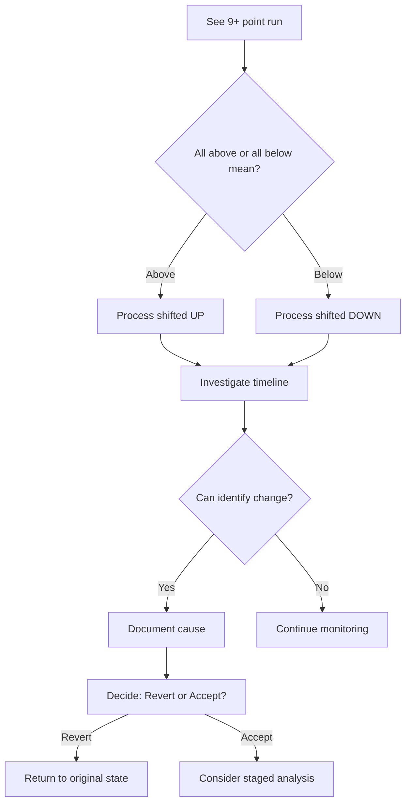

# Nelson Rules

Nelson Rules detect special cause variation patterns in control charts. VariScout implements Nelson Rule 2 to identify sustained process shifts.

---

## Nelson Rule 2: Nine-Point Run

> "Nine or more consecutive points on the same side of the mean."

This pattern indicates a **sustained shift** in the process - not random fluctuation.

---

## What It Detects

| Pattern              | Meaning                             |
| -------------------- | ----------------------------------- |
| 9+ points above mean | Process shifted UP                  |
| 9+ points below mean | Process shifted DOWN                |
| Exactly on mean      | Point doesn't count for either side |

---

## Why It Matters

A single point outside control limits is obvious. But a sustained run on one side of the mean is equally significant - it means something systematic changed:

- New material batch
- Adjusted machine settings
- Different operator technique
- Environmental change (temperature, humidity)
- Measurement system drift

---

## Probability

For a stable process:

- Probability of 9 consecutive points above mean: (0.5)⁹ = 0.2%
- This rare probability makes it a reliable signal

---

## How to Interpret



---

## Investigation Questions

When you see a run:

1. **When did it start?** - First point in the run
2. **What changed then?** - Review logs, batches, personnel
3. **Is the shift good or bad?** - Moving toward target = good
4. **Is it permanent?** - One-time or ongoing change?

---

## Actions Based on Finding

| Situation                   | Action                                            |
| --------------------------- | ------------------------------------------------- |
| Shift improved process      | Document as improvement, consider staged analysis |
| Shift degraded process      | Investigate root cause, correct                   |
| Cause unknown, stable shift | Monitor, document, maintain                       |
| Cause unknown, variable     | Investigate urgently                              |

---

## In VariScout

VariScout highlights Nelson Rule 2 violations directly on the I-Chart:

- Points in a run are **marked distinctly**
- Run length is displayed
- Sequences are tracked in Performance Mode

---

## Staged Analysis Connection

When a run indicates a genuine process shift (e.g., after an improvement project):

1. The combined data shows a run violation
2. But the **new process state** may be stable
3. Use [Staged Analysis](staged-analysis.md) to calculate separate limits for before/after periods

---

## Technical Reference

VariScout's implementation:

```typescript
// From @variscout/core
import { getNelsonRule2ViolationPoints, getNelsonRule2Sequences } from '@variscout/core';

// Get indices of all points in violations
const violations = getNelsonRule2ViolationPoints(values, mean);

// Get sequence details (start, end, side, length)
const sequences = getNelsonRule2Sequences(values, mean);
```

**Test coverage:** 30+ test cases in `packages/core/src/__tests__/nelson.test.ts`

---

## See Also

- [I-Chart](i-chart.md) - Where Nelson rules are displayed
- [Staged Analysis](staged-analysis.md) - Handling legitimate process shifts
- [Glossary: Nelson Rule 2](../../glossary.md#nelson-rule-2)
- [Glossary: Special Cause](../../glossary.md#special-cause)
- [CHANGE Pillar](../../01-vision/four-pillars/change.md) - Time-based stability
