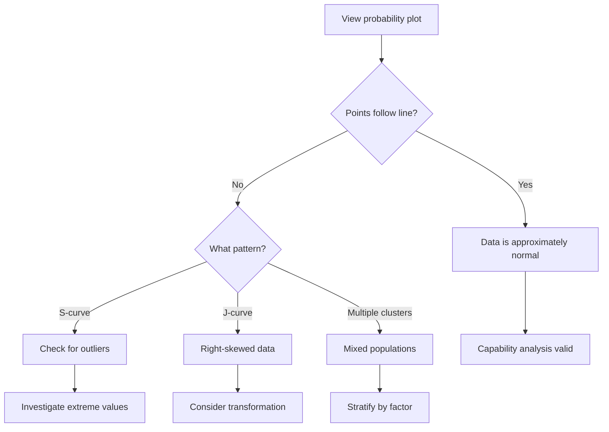

# Probability Plot

The probability plot assesses whether data follows a normal distribution, which underpins capability analysis and control chart assumptions.

---

## Purpose

_"Is my data normally distributed?"_

Many statistical methods assume normality:

- **Cp/Cpk calculations** rely on normal distribution
- **Control limits** (±3σ) assume symmetric, bell-shaped data
- **Expected performance** predictions depend on distribution shape

The probability plot provides a visual answer.

---

## How to Read It

### Linear = Normal

If your data is normally distributed, points fall along a **straight diagonal line**.

```
Normal Data:           Non-Normal Data:
     •                       •
    •  95%                   •
   •                       •
  •  line               •
 •                    •
•                   •
```

### Deviations from the Line

| Pattern            | Meaning                         |
| ------------------ | ------------------------------- |
| Points follow line | Normal distribution             |
| S-curve            | Heavy tails (outliers)          |
| J-curve            | Skewed right                    |
| Inverted J         | Skewed left                     |
| Multiple clusters  | Multi-modal (mixed populations) |

---

## Confidence Bands

VariScout shows **95% confidence bands** around the expected line:

- Points **within bands** = consistent with normality
- Points **outside bands** = significant deviation

A few points outside bands (especially at extremes) is normal. Systematic patterns outside bands indicate non-normality.

---

## Interpretation Workflow



---

## Technical Details

### Median Rank (Benard's Formula)

VariScout uses **Benard's approximation** for expected percentiles:

```
p = (i - 0.3) / (n + 0.4)
```

Where:

- `i` = rank position (1, 2, 3, ...)
- `n` = sample size
- `p` = expected cumulative probability

This formula is the **industry standard** (used by Minitab, JMP, and other statistical software).

### Normal Quantile

The Y-axis shows the **normal quantile** (z-score) calculated using the **Acklam algorithm** for the inverse cumulative distribution function.

---

## When Normality Fails

### Consequences

| Impact Area           | Effect of Non-Normality                |
| --------------------- | -------------------------------------- |
| Cpk                   | May overstate or understate capability |
| Control limits        | May be too wide or too narrow          |
| Pass rate predictions | Will be inaccurate                     |

### Solutions

| Approach                   | When to Use                            |
| -------------------------- | -------------------------------------- |
| Transform data             | Known skewness (e.g., log transform)   |
| Use non-parametric methods | When transformation not appropriate    |
| Stratify by factor         | Multi-modal suggests mixed populations |
| Increase sample size       | Small samples often appear non-normal  |
| Accept approximation       | Mild non-normality, large samples      |

---

## Example Interpretations

### Example 1: Normal Data

Points follow the line closely, all within confidence bands.

**Conclusion:** Capability metrics are reliable.

### Example 2: Heavy Tails

S-shaped curve with points outside bands at both ends.

**Conclusion:** More extreme values than normal predicts. Investigate for outliers or investigate the process for occasional disruptions.

### Example 3: Right Skew

J-shaped curve, data clustered at low end.

**Conclusion:** Process has a floor (can't go below zero?) but occasional high values. Consider log transformation or non-parametric analysis.

---

## Probability Plot vs. Histogram

| Aspect               | Probability Plot | Histogram         |
| -------------------- | ---------------- | ----------------- |
| Normality assessment | Excellent        | Good              |
| Tail behavior        | Clear            | Hard to see       |
| Small samples        | Works well       | Can be misleading |
| Outlier detection    | Good             | Depends on bins   |
| Distribution shape   | Precise          | Approximate       |

Use **both** for comprehensive assessment.

---

## Technical Reference

VariScout's implementation:

```typescript
// From @variscout/core
import { calculateProbabilityPlotData } from '@variscout/core';

const plotData = calculateProbabilityPlotData(values);

// Returns array of:
// {
//   value: number,          // Sorted data value
//   percentile: number,     // Benard's median rank
//   normalQuantile: number, // Z-score (Acklam)
//   ciLower: number,        // 95% CI lower bound
//   ciUpper: number         // 95% CI upper bound
// }
```

**Test coverage:** See `packages/core/src/__tests__/stats.test.ts` for probability plot tests.

---

## See Also

- [Capability](capability.md) - Where normality matters most
- [Chart Design: Probability Plot](../../06-design-system/charts/probability-plot.md)
- [Glossary: Normal Distribution](../../glossary.md#normal-distribution)
- [Histogram (Capability Chart)](capability.md) - Alternative view
