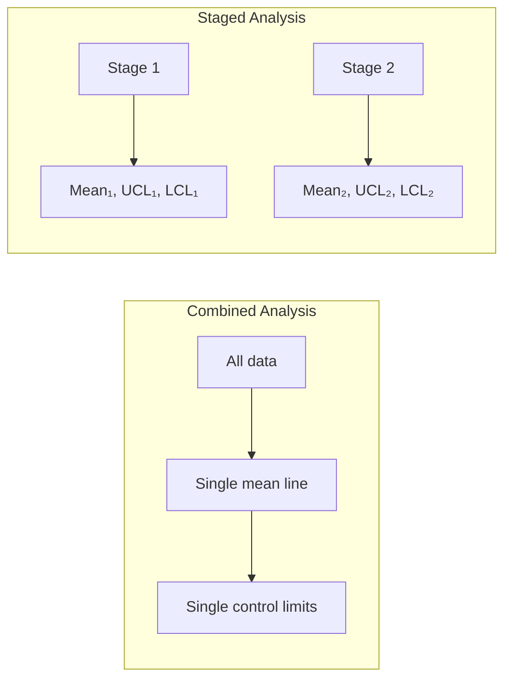
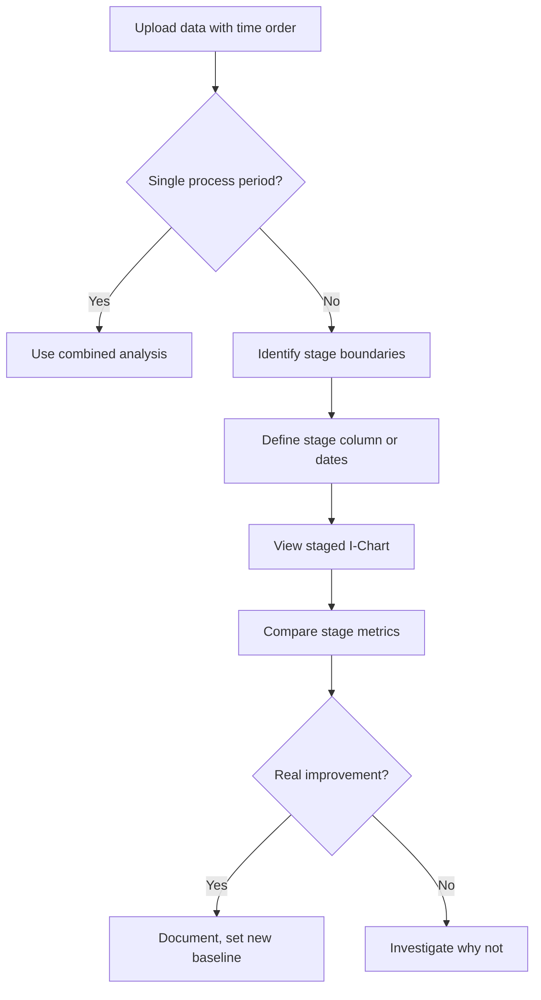

# Staged Analysis

Staged analysis calculates independent control limits for different time periods, revealing improvements that combined analysis would hide.

---

## Purpose

_"Has the process actually improved, or are we averaging good with bad?"_

When a process changes (improvement project, new equipment, different supplier), combining all data can:

- **Mask improvements** - Better recent performance drowns in historical noise
- **Create false violations** - Good new data appears "out of control" against old limits
- **Mislead decisions** - Average hides the real current state

---

## When to Use Staged Analysis

| Situation                        | Use Staged? | Why                       |
| -------------------------------- | ----------- | ------------------------- |
| Improvement project before/after | ✓           | See actual impact         |
| Multiple material batches        | ✓           | Compare batch performance |
| Equipment replacement            | ✓           | Validate new equipment    |
| Process change mid-dataset       | ✓           | Separate old vs new       |
| Continuous stable process        | ✗           | Combined is appropriate   |
| Investigating instability        | Depends     | May reveal hidden shifts  |

---

## How It Works

### Combined Analysis

```
All Data → Single Mean → Single UCL/LCL
```

Every point is judged against the same limits calculated from all data.

### Staged Analysis

```
Stage 1 Data → Stage 1 Mean → Stage 1 UCL/LCL
Stage 2 Data → Stage 2 Mean → Stage 2 UCL/LCL
...
```

Each stage gets its own baseline, calculated only from that stage's data.

---

## Visual Example



---

## Interpretation Guide

### Comparing Stages

| What Changed                   | Interpretation                                            |
| ------------------------------ | --------------------------------------------------------- |
| Mean shifted down              | Process center improved (if lower is better)              |
| Mean shifted up                | Process center degraded (or improved if higher is better) |
| Control limits narrowed        | Variation reduced - more consistent                       |
| Control limits widened         | Variation increased - less consistent                     |
| Both improved                  | Successful improvement project                            |
| Mean improved, variation worse | Partial success - investigate                             |

### Cpk Comparison

| Stage      | Cpk  | Meaning                     |
| ---------- | ---- | --------------------------- |
| Before     | 0.8  | Marginal capability         |
| After      | 1.4  | Good capability             |
| **Change** | +0.6 | **Significant improvement** |

---

## Workflow



---

## Stage Definition Options

### Option 1: Stage Column

Add a column to your data indicating the stage:

| Row | Value | Stage  |
| --- | ----- | ------ |
| 1   | 10.2  | Before |
| 2   | 10.5  | Before |
| ... | ...   | ...    |
| 50  | 9.8   | After  |
| 51  | 9.7   | After  |

### Option 2: Date-Based

Use a date column with a known cutoff:

- Before: All rows before improvement date
- After: All rows on or after improvement date

### Option 3: Row Position

Define stage by row ranges:

- Stage 1: Rows 1-100
- Stage 2: Rows 101-200

---

## Example: Improvement Project

**Scenario:** Fill weight optimization project

| Metric  | Before (n=50) | After (n=50) |
| ------- | ------------- | ------------ |
| Mean    | 502.3g        | 500.1g       |
| Std Dev | 2.8g          | 1.9g         |
| UCL     | 510.7g        | 505.8g       |
| LCL     | 493.9g        | 494.4g       |
| Cpk     | 0.89          | 1.32         |

**Conclusion:** Project succeeded - closer to target (500g) with less variation.

---

## Avoiding the "Aggregation Trap"

Combined analysis can mislead:

```
Before: Mean = 502, StdDev = 2.8
After:  Mean = 500, StdDev = 1.9
Combined: Mean = 501, StdDev = 2.5 ← Hides both the shift and the improvement!
```

Staged analysis reveals the truth that aggregated data conceals.

---

## Technical Reference

VariScout's implementation:

```typescript
// From @variscout/core
import { calculateStagedStats, getStageBoundaries } from '@variscout/core';

// Calculate per-stage statistics
const stagedStats = calculateStagedStats(
  data, // DataRow[]
  measureColumn, // e.g., 'FillWeight'
  stageColumn, // e.g., 'Period'
  stageOrder // 'data' | 'alphabetical' | 'chronological'
);

// Get boundaries for chart rendering
const boundaries = getStageBoundaries(sortedData, stagedStats);
```

**Test coverage:** See `packages/core/src/__tests__/stats.test.ts` for stage boundary tests.

---

## See Also

- [I-Chart](i-chart.md) - Where staged analysis is displayed
- [Nelson Rules](nelson-rules.md) - Detecting runs that signal shifts
- [Capability](capability.md) - Comparing Cpk between stages
- [Glossary: Staged Analysis](../../glossary.md#staged-analysis)
- [Case: Hospital Ward](../../04-cases/hospital-ward/index.md) - Aggregation trap example
