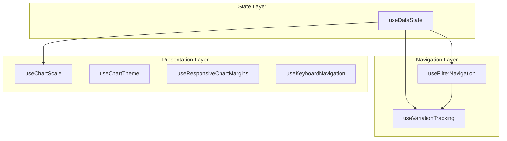
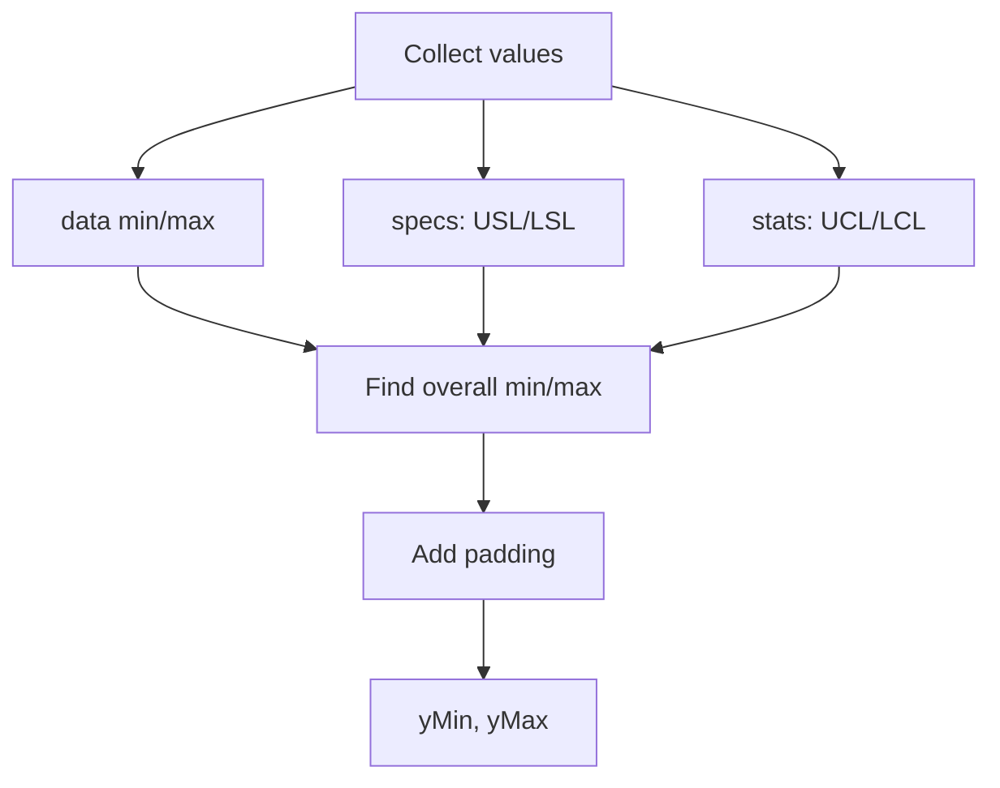

# Component Patterns

How VariScout's shared hooks work together to enable drill-down, filtering, and analysis.

---

## Hook Architecture Overview



---

## useDataState

**Central state management for data and specifications.**

### Input

| Parameter     | Type                 | Description                       |
| ------------- | -------------------- | --------------------------------- |
| `persistence` | `PersistenceAdapter` | Platform-specific storage adapter |
| `initialData` | `DataRow[]`          | Optional initial dataset          |

### Output (State)

| Property                 | Type                         | Description                   |
| ------------------------ | ---------------------------- | ----------------------------- |
| `rawData`                | `DataRow[]`                  | Original unfiltered dataset   |
| `filteredData`           | `DataRow[]`                  | Data after filter application |
| `specs`                  | `SpecLimits`                 | Global USL/LSL/target         |
| `measureSpecs`           | `Record<string, SpecLimits>` | Per-measure overrides         |
| `getSpecsForMeasure(id)` | `Function`                   | Get effective specs           |
| `isPerformanceMode`      | `boolean`                    | Multi-measure mode active     |
| `measureColumns`         | `string[]`                   | Selected measure columns      |
| `filters`                | `FilterState`                | Active filter conditions      |

### Output (Actions)

| Action               | Parameters       | Effect                   |
| -------------------- | ---------------- | ------------------------ |
| `setData`            | `DataRow[]`      | Replace dataset          |
| `setSpecs`           | `SpecLimits`     | Update global specs      |
| `setMeasureSpec`     | `id, SpecLimits` | Set per-measure override |
| `setFilters`         | `FilterState`    | Update active filters    |
| `setPerformanceMode` | `boolean`        | Toggle Performance Mode  |
| `reset`              | -                | Clear all state          |

### Usage Example

```tsx
const [state, actions] = useDataState({ persistence: indexedDBAdapter });

// Get specs with per-measure override fallback
const specs = state.getSpecsForMeasure('FillHead_1');

// Update specs for specific measure
actions.setMeasureSpec('FillHead_1', { usl: 105, lsl: 95 });
```

---

## useFilterNavigation

**Manages drill-down navigation with multi-select support.**

### Input

| Parameter        | Type          | Description           |
| ---------------- | ------------- | --------------------- |
| `data`           | `DataRow[]`   | Dataset to filter     |
| `initialFilters` | `FilterState` | Starting filter state |

### Output

| Property           | Type               | Description             |
| ------------------ | ------------------ | ----------------------- |
| `filters`          | `FilterState`      | Current active filters  |
| `breadcrumbs`      | `BreadcrumbItem[]` | Navigation path         |
| `drillPath`        | `DrillLevel[]`     | Complete drill history  |
| `availableFactors` | `string[]`         | Factors not yet drilled |

| Method               | Parameters         | Description              |
| -------------------- | ------------------ | ------------------------ |
| `addFilter`          | `factor, value`    | Add single filter        |
| `updateFilterValues` | `factor, values[]` | Set multi-select values  |
| `removeFilter`       | `factor`           | Remove filter for factor |
| `clearFilters`       | -                  | Reset to unfiltered      |
| `goToLevel`          | `index`            | Navigate breadcrumb      |

### Filter State Shape

```typescript
interface FilterState {
  [factorName: string]: {
    values: string[]; // Selected values (multi-select)
    singleValue?: string; // Legacy single-select
  };
}
```

### Usage Example

```tsx
const { filters, breadcrumbs, addFilter, updateFilterValues, removeFilter } = useFilterNavigation(
  rawData,
  {}
);

// Single filter
addFilter('Shift', 'Night');

// Multi-select filter
updateFilterValues('Machine', ['A', 'B', 'C']);

// Navigate breadcrumb
goToLevel(1); // Go back to first drill level
```

---

## useVariationTracking

**Tracks cumulative variation explained through drill-down path.**

### Input

| Parameter   | Type           | Description         |
| ----------- | -------------- | ------------------- |
| `data`      | `DataRow[]`    | Dataset             |
| `outcome`   | `string`       | Outcome column name |
| `drillPath` | `DrillLevel[]` | Current drill path  |

### Output

| Property               | Type               | Description             |
| ---------------------- | ------------------ | ----------------------- |
| `cumulativeEtaSquared` | `number`           | Total η² explained      |
| `filterChipData`       | `FilterChipData[]` | Per-filter contribution |
| `remainingVariation`   | `number`           | 1 - cumulative η²       |

### FilterChipData Shape

```typescript
interface FilterChipData {
  factor: string; // Factor name
  values: string[]; // Selected values
  etaSquared: number; // This factor's η²
  contribution: number; // Percentage of total
  cumulativeEtaSquared: number; // Running total
}
```

### Usage Example

```tsx
const { cumulativeEtaSquared, filterChipData, remainingVariation } = useVariationTracking(
  filteredData,
  'Weight',
  drillPath
);

// Display in filter chips
filterChipData.map(chip => (
  <FilterChip
    key={chip.factor}
    label={`${chip.factor}: ${chip.values.join(', ')}`}
    contribution={`${(chip.contribution * 100).toFixed(0)}%`}
  />
));
```

---

## useChartScale

**Calculates optimal Y-axis scale for charts.**

### Input

| Parameter | Type          | Description                  |
| --------- | ------------- | ---------------------------- |
| `data`    | `number[]`    | Data values                  |
| `specs`   | `SpecLimits`  | Specification limits         |
| `stats`   | `StatsResult` | Calculated statistics        |
| `padding` | `number`      | Scale padding (default: 0.1) |

### Output

| Property | Type               | Description          |
| -------- | ------------------ | -------------------- |
| `yMin`   | `number`           | Scale minimum        |
| `yMax`   | `number`           | Scale maximum        |
| `domain` | `[number, number]` | D3-compatible domain |

### Scale Logic



---

## useChartTheme

**Provides theme-aware colors for charts.**

### Input

None (reads from document `data-theme` attribute).

### Output

| Property    | Type           | Description                     |
| ----------- | -------------- | ------------------------------- |
| `isDark`    | `boolean`      | Dark theme active               |
| `chrome`    | `ChromeColors` | Theme-appropriate chrome colors |
| `fontScale` | `number`       | Font scaling factor             |

### Chrome Colors

| Property         | Dark      | Light     | Use              |
| ---------------- | --------- | --------- | ---------------- |
| `gridLine`       | `#1e293b` | `#f1f5f9` | Chart grid       |
| `axisPrimary`    | `#94a3b8` | `#64748b` | Axis lines       |
| `axisSecondary`  | `#64748b` | `#94a3b8` | Secondary axes   |
| `labelPrimary`   | `#cbd5e1` | `#334155` | Primary labels   |
| `labelSecondary` | `#94a3b8` | `#64748b` | Secondary labels |

### Usage Example

```tsx
const { isDark, chrome } = useChartTheme();

<AxisLeft
  stroke={chrome.axisPrimary}
  tickStroke={chrome.axisSecondary}
  tickLabelProps={{ fill: chrome.labelPrimary }}
/>;
```

---

## useResponsiveChartMargins

**Calculates dynamic margins based on container width.**

### Input

| Parameter     | Type     | Description              |
| ------------- | -------- | ------------------------ |
| `width`       | `number` | Container width          |
| `chartType`   | `string` | Chart type identifier    |
| `extraBottom` | `number` | Additional bottom margin |

### Output

| Property       | Type      | Description                    |
| -------------- | --------- | ------------------------------ |
| `margins`      | `Margins` | `{ top, right, bottom, left }` |
| `tickFontSize` | `number`  | Responsive tick label size     |
| `axisFontSize` | `number`  | Responsive axis label size     |
| `statFontSize` | `number`  | Responsive stat display size   |

### Breakpoints

| Width     | Category | Left Margin |
| --------- | -------- | ----------- |
| <400px    | Mobile   | 40px        |
| 400-600px | Tablet   | 50px        |
| >600px    | Desktop  | 60px        |

---

## useKeyboardNavigation

**Enables keyboard control for chart interactions.**

### Input

| Parameter   | Type             | Description        |
| ----------- | ---------------- | ------------------ |
| `items`     | `any[]`          | Navigable items    |
| `onSelect`  | `(item) => void` | Selection callback |
| `isEnabled` | `boolean`        | Active state       |

### Output

| Property          | Type               | Description    |
| ----------------- | ------------------ | -------------- |
| `focusedIndex`    | `number`           | Current focus  |
| `setFocusedIndex` | `Function`         | Manual focus   |
| `handlers`        | `KeyboardHandlers` | Event handlers |

### Key Bindings

| Key                        | Action         |
| -------------------------- | -------------- |
| `ArrowRight` / `ArrowDown` | Next item      |
| `ArrowLeft` / `ArrowUp`    | Previous item  |
| `Enter` / `Space`          | Select focused |
| `Escape`                   | Clear focus    |
| `Home`                     | First item     |
| `End`                      | Last item      |

---

## Integration Example

**Complete flow from data load to filtered chart:**

```tsx
function Dashboard() {
  // 1. State management
  const [state, actions] = useDataState({ persistence });

  // 2. Filter navigation
  const { filters, breadcrumbs, addFilter } = useFilterNavigation(state.rawData, state.filters);

  // 3. Variation tracking
  const { filterChipData, cumulativeEtaSquared } = useVariationTracking(
    state.filteredData,
    'Weight',
    breadcrumbs.map(b => ({ factor: b.factor, values: b.values }))
  );

  // 4. Chart scale
  const { domain } = useChartScale(
    state.filteredData.map(d => d.Weight),
    state.specs,
    stats
  );

  // 5. Theme
  const { chrome, isDark } = useChartTheme();

  return (
    <>
      <FilterBreadcrumb
        chips={filterChipData}
        onRemove={removeFilter}
        cumulativeEtaSquared={cumulativeEtaSquared}
      />
      <IChart
        data={state.filteredData}
        specs={state.specs}
        yDomain={domain}
        theme={chrome}
        onPointClick={point => addFilter(nextFactor, point[nextFactor])}
      />
    </>
  );
}
```

---

## Shared UI Components

Components extracted to `@variscout/ui` use a **colorScheme prop pattern** for platform-agnostic theming.

### Pattern

```tsx
// Component defines interface and presets
export interface MyComponentColorScheme {
  background: string; // Tailwind class
  text: string;
  border: string;
}

export const defaultColorScheme: MyComponentColorScheme = {
  background: 'bg-surface-secondary', // PWA semantic
  text: 'text-content',
  border: 'border-edge',
};

export const azureColorScheme: MyComponentColorScheme = {
  background: 'bg-slate-800', // Tailwind Slate
  text: 'text-white',
  border: 'border-slate-700',
};
```

### Usage

```tsx
// PWA - uses default (semantic tokens)
<FilterBreadcrumb {...props} />;

// Azure - uses Azure scheme (Slate palette)
import { filterBreadcrumbAzureColorScheme } from '@variscout/ui';
<FilterBreadcrumb {...props} colorScheme={filterBreadcrumbAzureColorScheme} />;
```

### Available Components

| Component                   | Base | Color Schemes  | Context-Free               |
| --------------------------- | ---- | -------------- | -------------------------- |
| `FilterBreadcrumb`          | ✓    | default, azure | ✓                          |
| `FilterChipDropdown`        | ✓    | default, azure | ✓                          |
| `VariationBar`              | ✓    | default, azure | ✓                          |
| `AnovaResults`              | ✓    | default, azure | ✓                          |
| `YAxisPopover`              | ✓    | default, azure | ✓                          |
| `RegressionPanelBase`       | ✓    | default, azure | Uses render props          |
| `PerformanceSetupPanelBase` | ✓    | default, pwa   | Props + optional tierProps |

### Base Components with Render Props

Some components use render props to delegate app-specific rendering:

```tsx
// RegressionPanelBase delegates chart rendering to apps
<RegressionPanelBase
  filteredData={data}
  outcome={outcome}
  specs={specs}
  renderSimpleView={props => <SimpleRegressionView {...props} />}
  renderAdvancedView={props => <AdvancedRegressionView {...props} />}
  colorScheme={regressionPanelAzureColorScheme}
/>
```

See [Colors > Shared Component Color Schemes](../../06-design-system/foundations/colors.md#shared-component-color-schemes) for the complete color mapping.

---

## See Also

- [Data Flow](data-flow.md) - How data moves through the system
- [Shared Packages](shared-packages.md) - Package exports
- [Colors > Color Schemes](../../06-design-system/foundations/colors.md#shared-component-color-schemes) - ColorScheme prop pattern
- [Charts Overview](../../06-design-system/charts/overview.md) - Chart components
- [ADR-005: Props-Based Charts](../../07-decisions/adr-005-props-based-charts.md)
