# Data Flow Architecture

How data moves through VariScout from upload to persistence.

---

## Overview

VariScout processes data entirely client-side. This diagram shows the complete flow:

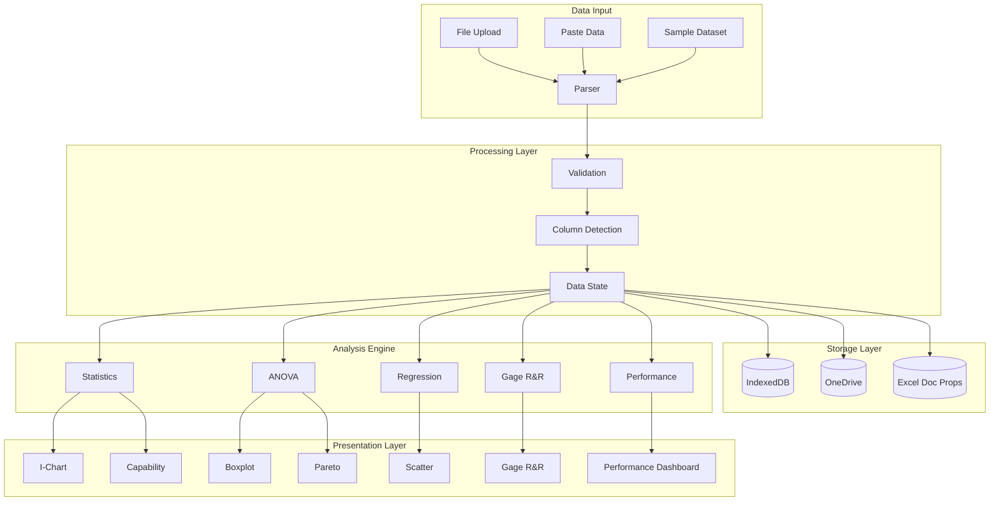

---

## Data Input Stage

### File Upload Flow

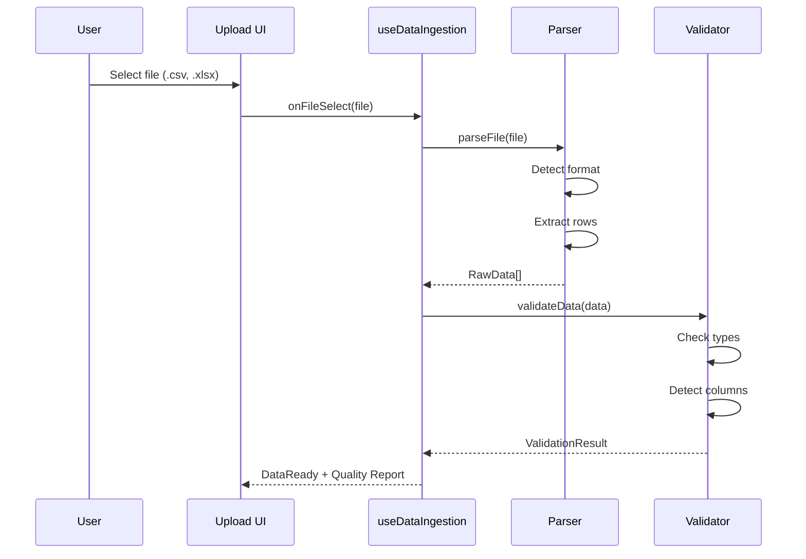

### Supported Formats

| Format        | Parser   | Notes                  |
| ------------- | -------- | ---------------------- |
| CSV           | Built-in | Auto-detects delimiter |
| TSV           | Built-in | Tab-separated          |
| Excel (.xlsx) | SheetJS  | First sheet by default |
| Paste         | Built-in | Tab/comma detection    |

---

## Validation Stage

### Column Detection

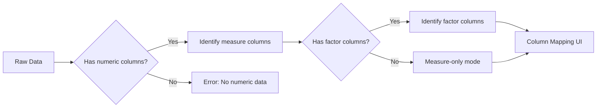

### Keyword Detection

The parser detects special columns by keywords:

| Keyword Pattern          | Column Type         | Example         |
| ------------------------ | ------------------- | --------------- |
| `operator`, `inspector`  | Operator (Gage R&R) | "Operator Name" |
| `part`, `sample`, `item` | Part ID (Gage R&R)  | "Sample ID"     |
| `usl`, `upper spec`      | Specification       | "USL_Weight"    |
| `lsl`, `lower spec`      | Specification       | "LSL_Weight"    |
| `target`                 | Specification       | "Target Value"  |

### Data Quality Report

```typescript
interface ValidationResult {
  isValid: boolean;
  rowCount: number;
  columnCount: number;
  numericColumns: string[];
  factorColumns: string[];
  warnings: ValidationWarning[];
  errors: ValidationError[];
}
```

---

## State Management

### DataContext Structure

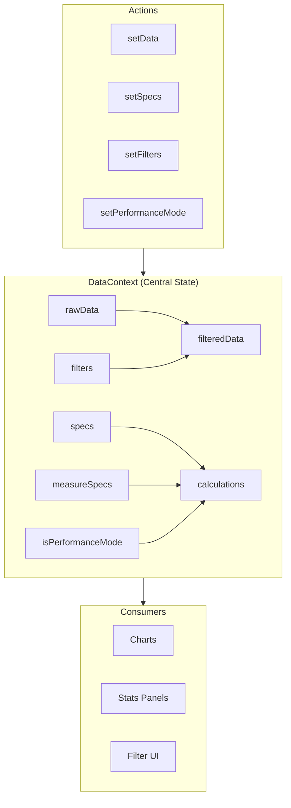

### Filter Application

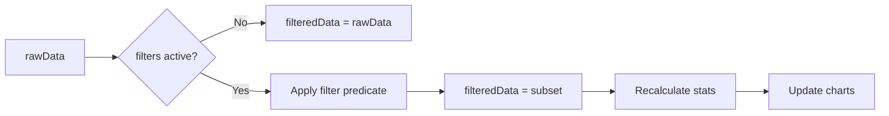

---

## Analysis Engine

### Statistics Calculation

```mermaid
flowchart TD
    subgraph Input
        D[filteredData]
        S[specs: USL, LSL, target]
    end

    subgraph Core["calculateStats()"]
        M[mean = Σx/n]
        SD[stdDev = √(Σ(x-μ)²/n)]
        CL[UCL = μ + 3σ<br/>LCL = μ - 3σ]
        CP[Cp = (USL-LSL)/6σ]
        CPK[Cpk = min(CPU, CPL)]
    end

    Input --> Core
    Core --> R[StatsResult]
```

### ANOVA Calculation

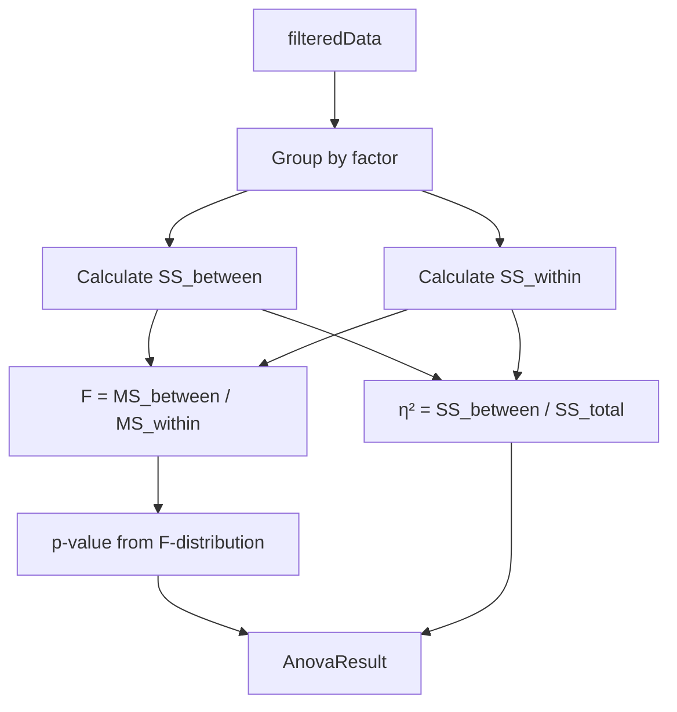

---

## Platform-Specific Flows

### PWA Data Flow

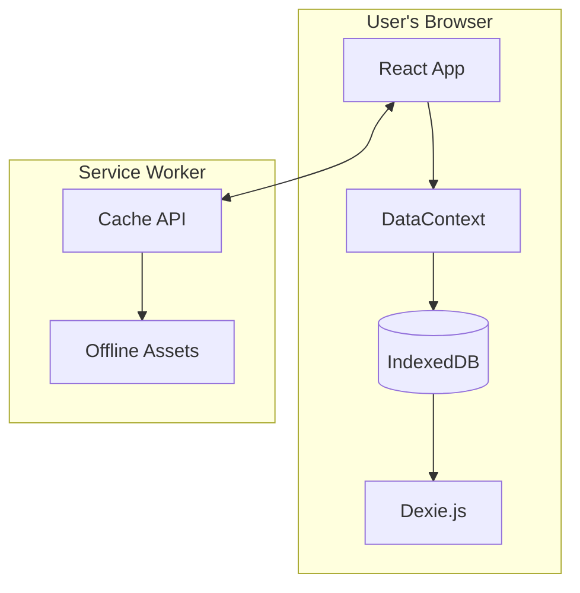

### Azure App Data Flow

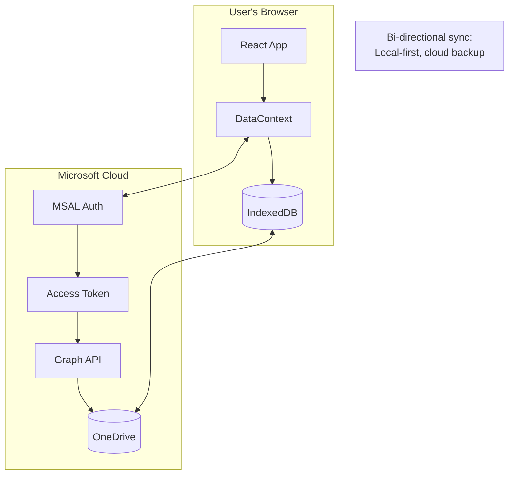

### Excel Add-in Data Flow

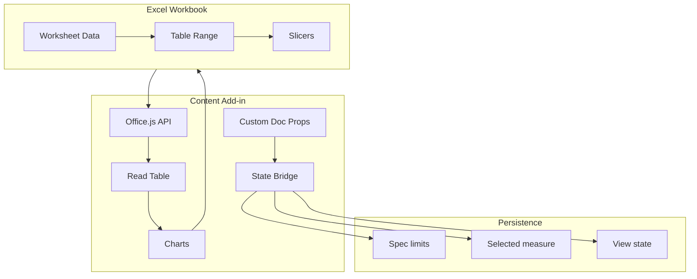

---

## Hook Dependencies

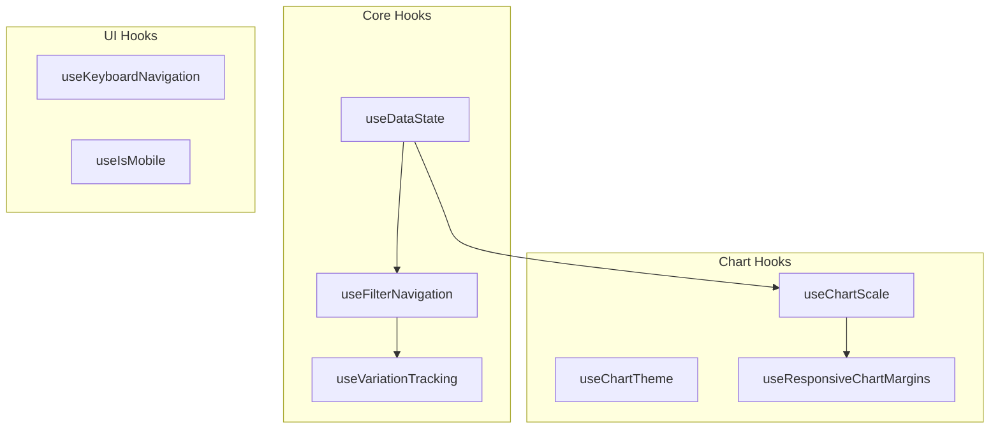

---

## Data Export

### Export Formats

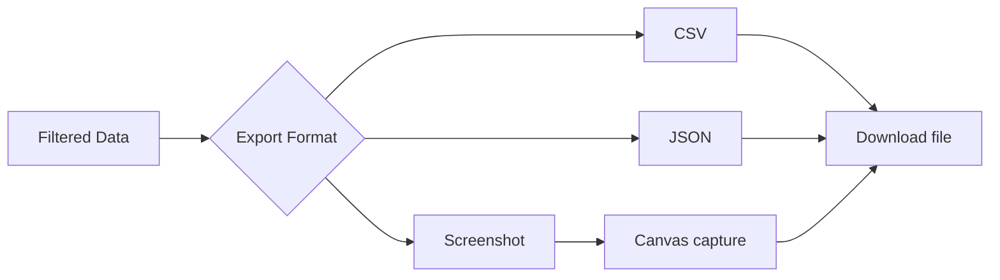

---

## See Also

- [Component Patterns](component-patterns.md) - Hook integration details
- [Offline-First](offline-first.md) - Persistence strategy
- [Shared Packages](shared-packages.md) - Package responsibilities
- [PWA Storage](../../08-products/pwa/storage.md) - IndexedDB details
- [OneDrive Sync](../../08-products/azure/onedrive-sync.md) - Cloud sync details
