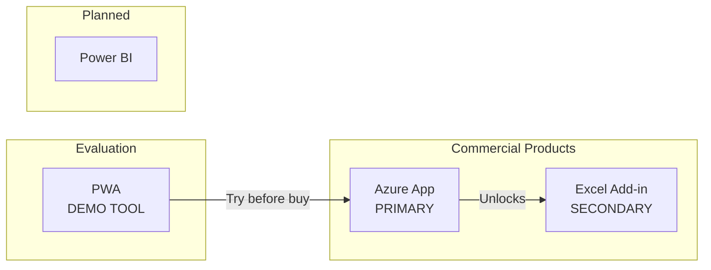

# Products

VariScout is distributed through Microsoft's ecosystem with the **Azure App as the primary commercial product**.

---

## Distribution Hierarchy

Per [ADR-007](../07-decisions/adr-007-azure-marketplace-distribution.md):



## Product Matrix

| Product                         | Status      | Distribution      | Use Case                  | Pricing                   |
| ------------------------------- | ----------- | ----------------- | ------------------------- | ------------------------- |
| **[Azure App](azure/index.md)** | **PRIMARY** | Azure Marketplace | Teams & enterprises       | €99/€499/€1,790/year      |
| [Excel Add-in](excel/index.md)  | Production  | AppSource         | Excel-native workflows    | FREE (unlocks with Azure) |
| [PWA](pwa/index.md)             | Demo only   | Direct URL        | Evaluation & learning     | N/A                       |
| [Power BI](powerbi/index.md)    | Planned     | AppSource         | Dashboard integration     | TBD                       |
| [Website](website/index.md)     | Production  | Public            | Marketing & documentation | N/A                       |

!!! tip "Evaluation Path"
**Try → Buy → Extend**: Start with the [PWA demo](pwa/index.md) (pre-loaded case studies), purchase [Azure App](azure/index.md) for production use, and the [Excel Add-in](excel/index.md) unlocks automatically.

---

## Distribution Strategy

```
┌─────────────────────────────────────────────────────────────┐
│  VariScout on Azure Marketplace (PRIMARY)                   │
│                                                             │
│  Individual Plan     €99/year    Single user               │
│  Team Plan           €499/year   Up to 10 users            │
│  Enterprise Plan     €1,790/year Unlimited tenant users    │
│                                                             │
│  Billing: Microsoft (3% fee)                               │
│  Data: Stays in customer's Azure tenant                    │
└─────────────────────────────────────────────────────────────┘

┌─────────────────────────────────────────────────────────────┐
│  Excel Add-in on AppSource (FREE)                          │
│                                                             │
│  • Free tier: Basic features for all users                 │
│  • Full tier: Auto-unlocks when tenant has Azure App       │
│  • Detection: Graph API checks for Azure App registration  │
└─────────────────────────────────────────────────────────────┘
```

---

## Feature Comparison

| Feature          | Azure App | Excel       | PWA (Demo) | Power BI         |
| ---------------- | --------- | ----------- | ---------- | ---------------- |
| I-Chart          | ✓         | ✓           | ✓          | Planned          |
| Boxplot          | ✓         | ✓           | ✓          | Planned          |
| Pareto           | ✓         | ✓           | ✓          | Planned          |
| Capability       | ✓         | ✓           | ✓          | Planned          |
| Regression       | ✓         | ✓           | ✓          | -                |
| Gage R&R         | ✓         | ✓           | ✓          | -                |
| Performance Mode | ✓         | ✓           | ✓          | -                |
| Drill-Down       | ✓         | Via slicers | ✓          | Native           |
| Linked Filtering | ✓         | Via slicers | ✓          | Native           |
| Offline          | Cached    | ✓           | ✓          | -                |
| Cloud Sync       | OneDrive  | OneDrive    | -          | Power BI Service |
| SSO              | Microsoft | Microsoft   | -          | Microsoft        |

---

## Pricing Tiers (Azure App)

| Tier       | Price/Year | Users     | Features                              |
| ---------- | ---------- | --------- | ------------------------------------- |
| Individual | €99        | 1         | Full analysis, OneDrive sync          |
| Team       | €499       | Up to 10  | + Shared projects, collaboration      |
| Enterprise | €1,790     | Unlimited | + Priority support, custom deployment |

All tiers include:

- All chart types and analysis features
- Microsoft Entra ID (Azure AD) SSO
- OneDrive project sync
- Offline support (cached)
- Data stays in customer's Azure tenant

---

## Architecture

All products share the same core packages:

```
@variscout/core     → Statistics, parsing, types
@variscout/charts   → Visx chart components
@variscout/hooks    → Shared React hooks
@variscout/ui       → UI utilities
```

This ensures:

- Identical statistical calculations across platforms
- Consistent chart appearance
- Shared methodology (Four Pillars)

---

## Deployment Models

| Product      | Deployment                      | Data Location               | License Detection        |
| ------------ | ------------------------------- | --------------------------- | ------------------------ |
| Azure App    | ARM template to customer tenant | Customer's Azure + OneDrive | Deployment tier config   |
| Excel Add-in | AppSource or sideload           | Excel workbook              | Graph API (tenant check) |
| PWA          | Static hosting (internal)       | Browser (IndexedDB)         | N/A (demo only)          |
| Power BI     | AppSource                       | Power BI Service            | TBD                      |

---

## Support Model

| Tier       | Included In            | Support Channel               |
| ---------- | ---------------------- | ----------------------------- |
| Community  | Free Excel Add-in tier | GitHub Issues                 |
| Standard   | Individual Azure tier  | Email (48h response)          |
| Team       | Team Azure tier        | Email (24h response)          |
| Enterprise | Enterprise Azure tier  | Email + deployment assistance |

---

## See Also

- [ADR-007: Azure Marketplace Distribution](../07-decisions/adr-007-azure-marketplace-distribution.md)
- [Azure Marketplace Guide](azure/marketplace.md)
- [Excel AppSource Guide](excel/appsource.md)
