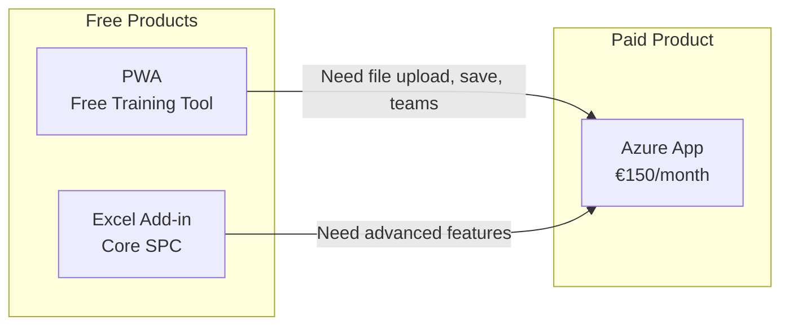

# Products

VariScout is distributed through Microsoft's ecosystem with the **Azure App as the only paid product**.

---

## Distribution Hierarchy

Per [ADR-007](../07-decisions/adr-007-azure-marketplace-distribution.md):



## Product Matrix

| Product                         | Status      | Distribution      | Use Case                  | Pricing        |
| ------------------------------- | ----------- | ----------------- | ------------------------- | -------------- |
| **[Azure App](azure/index.md)** | **PRIMARY** | Azure Marketplace | Teams & enterprises       | €150/month     |
| [Excel Add-in](excel/index.md)  | Production  | AppSource         | Excel-native core SPC     | FREE (forever) |
| [PWA](pwa/index.md)             | Production  | Direct URL        | Training & education      | FREE (forever) |
| [Power BI](powerbi/index.md)    | Planned     | AppSource         | Dashboard integration     | TBD            |
| [Website](website/index.md)     | Production  | Public            | Marketing & documentation | N/A            |

!!! tip "Getting Started"
**Free tools**: Start with the [PWA](pwa/index.md) (free training tool with copy-paste input) or the [Excel Add-in](excel/index.md) (free core SPC). Upgrade to the [Azure App](azure/index.md) for file upload, save/persistence, Performance Mode, and team features.

---

## Distribution Strategy

```
┌─────────────────────────────────────────────────────────────┐
│  VariScout on Azure Marketplace (PRIMARY)                   │
│                                                             │
│  Single Plan       €150/month   All features               │
│                                  Unlimited users in tenant  │
│                                                             │
│  Offer type: Managed Application                           │
│  Billing: Microsoft (3% fee, monthly)                      │
│  Data: Stays in customer's Azure tenant                    │
└─────────────────────────────────────────────────────────────┘

┌─────────────────────────────────────────────────────────────┐
│  Excel Add-in on AppSource (FREE FOREVER)                   │
│                                                             │
│  • Core SPC: I-Chart, Boxplot, Pareto, Capability          │
│  • No Performance Mode (Azure App exclusive)               │
│  • No license detection, no Graph API                      │
│  • Marketing funnel → users upgrade to Azure App           │
└─────────────────────────────────────────────────────────────┘
```

---

## Feature Comparison

| Feature          | Azure App | Excel       | PWA (Free) | Power BI         |
| ---------------- | --------- | ----------- | ---------- | ---------------- |
| I-Chart          | ✓         | ✓           | ✓          | Planned          |
| Boxplot          | ✓         | ✓           | ✓          | Planned          |
| Pareto           | ✓         | ✓           | ✓          | Planned          |
| Capability       | ✓         | ✓           | ✓          | Planned          |
| Regression       | ✓         | -           | ✓          | -                |
| Gage R&R         | ✓         | -           | ✓          | -                |
| Performance Mode | ✓         | -           | -          | -                |
| File Upload      | ✓         | Native      | -          | -                |
| Save/Persistence | ✓         | In workbook | -          | Power BI Service |
| Drill-Down       | ✓         | Via slicers | ✓          | Native           |
| Linked Filtering | ✓         | Via slicers | ✓          | Native           |
| Offline          | Cached    | ✓           | ✓          | -                |
| Cloud Sync       | OneDrive  | -           | -          | Power BI Service |
| SSO              | Microsoft | -           | -          | Microsoft        |

> Excel Add-in provides core SPC charts only. Advanced analysis requires the Azure App.

---

## Pricing (Azure App)

| Aspect      | Value                                              |
| ----------- | -------------------------------------------------- |
| Price       | €150/month (all features, unlimited users)         |
| Billing     | Monthly (Microsoft handles billing, 3% fee)        |
| Net revenue | €145.50/month (€1,746/year)                        |
| Model       | Per-deployment (one subscription per Azure tenant) |

All features included:

- All chart types and analysis features
- Performance Mode (multi-channel Cpk)
- Microsoft Entra ID (Azure AD) SSO
- OneDrive project sync
- Offline support (cached)
- Data stays in customer's Azure tenant

---

## Architecture

All products share the same core packages:

```
@variscout/core     → Statistics, parsing, types
@variscout/charts   → Visx chart components
@variscout/hooks    → Shared React hooks
@variscout/ui       → UI utilities
```

This ensures:

- Identical statistical calculations across platforms
- Consistent chart appearance
- Shared methodology (Four Pillars)

---

## Deployment Models

| Product      | Deployment                             | Data Location               | License                          |
| ------------ | -------------------------------------- | --------------------------- | -------------------------------- |
| Azure App    | Managed Application to customer tenant | Customer's Azure + OneDrive | Deployment config (all features) |
| Excel Add-in | AppSource or sideload                  | Excel workbook              | Always free (no detection)       |
| PWA          | Static hosting (public)                | Browser (session only)      | Free forever (training)          |
| Power BI     | AppSource                              | Power BI Service            | TBD                              |

---

## Support Model

| Level     | Included In  | Support Channel      |
| --------- | ------------ | -------------------- |
| Community | Excel Add-in | GitHub Issues        |
| Standard  | Azure App    | Email (24h response) |

---

## See Also

- [ADR-007: Azure Marketplace Distribution](../07-decisions/adr-007-azure-marketplace-distribution.md)
- [Azure Marketplace Guide](azure/marketplace.md)
- [Excel AppSource Guide](excel/appsource.md)
