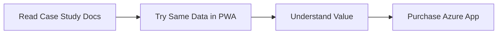

# PWA (Demo Tool)

> **Role**: Interactive demonstration and evaluation tool with pre-loaded case study datasets.
>
> Per [ADR-007](../../07-decisions/adr-007-azure-marketplace-distribution.md), the PWA serves as an evaluation gateway to the commercial [Azure App](../azure/index.md).

---

## Purpose: Try Before You Buy

The PWA is an **interactive demo tool** that lets users:

1. **Explore with real data** — Pre-loaded case study datasets
2. **Experience all features** — Full functionality for evaluation
3. **Learn the methodology** — Same datasets as documentation
4. **Decide without friction** — No signup, no payment required



---

## Pre-Loaded Case Studies

The PWA comes with datasets from the documentation case studies:

| Dataset       | Case Study                                                  | Demonstrates             |
| ------------- | ----------------------------------------------------------- | ------------------------ |
| Coffee        | [Coffee Case](../../04-cases/coffee/index.md)               | Factor comparison, MSA   |
| Bottleneck    | [Bottleneck Case](../../04-cases/bottleneck/index.md)       | Process flow, drill-down |
| Hospital Ward | [Hospital Ward Case](../../04-cases/hospital-ward/index.md) | Aggregation trap         |
| Packaging     | [Packaging Case](../../04-cases/packaging/index.md)         | Pareto, capability       |
| Sachets       | Performance Mode                                            | Multi-channel analysis   |

**Learning continuity**: The same data appears in docs → PWA → teaching materials.

---

## Use Cases

| Use Case               | Appropriate | Notes                              |
| ---------------------- | :---------: | ---------------------------------- |
| Evaluate features      |      ✓      | Full functionality                 |
| Try case study data    |      ✓      | Pre-loaded datasets                |
| Demo to stakeholders   |      ✓      | No setup required                  |
| Learn methodology      |      ✓      | Hands-on practice                  |
| Development reference  |      ✓      | Reference implementation           |
| **Production use**     |      ✗      | Use [Azure App](../azure/index.md) |
| **Team collaboration** |      ✗      | Use Azure App with OneDrive        |
| **Data persistence**   |   Limited   | Browser-only storage               |

---

## Overview

The PWA is a React application that:

- Runs entirely in the browser (no server required)
- Works offline after initial load
- Can be installed like a native app (Add to Home Screen)
- Stores data locally in IndexedDB
- **Pre-loaded with case study datasets** for immediate exploration

This implementation serves as the **reference codebase** for VariScout features before they're ported to Azure App and Excel Add-in.

---

## Technical Stack

| Component | Technology               |
| --------- | ------------------------ |
| Framework | React 18 + TypeScript    |
| Build     | Vite                     |
| Styling   | Tailwind CSS             |
| Charts    | Visx (@variscout/charts) |
| State     | React Context            |
| Storage   | IndexedDB (Dexie.js)     |
| Offline   | Service Worker           |

---

## Features

All features are available for evaluation:

- All chart types (I-Chart, Boxplot, Pareto, Capability, Regression, Gage R&R)
- Performance Mode for multi-channel analysis
- Drill-down with breadcrumb navigation
- Linked filtering across charts
- CSV/Excel file import
- Data export (CSV, JSON, screenshots)

---

## Architecture

```
┌─────────────────────────────────────────────────────────────────┐
│                         USER'S BROWSER                          │
├─────────────────────────────────────────────────────────────────┤
│  ┌─────────────────────────────────────────────────────────────┐ │
│  │                    REACT APPLICATION                         │ │
│  │   DataContext → Charts → Analysis                           │ │
│  └─────────────────────────────────────────────────────────────┘ │
│                              │                                   │
│  ┌─────────────────────────────────────────────────────────────┐ │
│  │                      IndexedDB                               │ │
│  │   Projects │ Settings                                       │ │
│  └─────────────────────────────────────────────────────────────┘ │
│                                                                  │
│  ┌─────────────────────────────────────────────────────────────┐ │
│  │                   Service Worker (offline)                   │ │
│  └─────────────────────────────────────────────────────────────┘ │
└──────────────────────────────────────────────────────────────────┘
```

---

## Development Commands

```bash
# Start development server
pnpm dev

# Build for production
pnpm build

# Run tests
pnpm --filter @variscout/pwa test
```

---

## Role in Development Workflow

The PWA serves as the **feature development sandbox**:

1. **New features** are prototyped in the PWA first
2. **Shared packages** are developed against PWA use cases
3. **Azure App** adopts features after PWA validation
4. **Excel Add-in** adapts features for Office.js constraints

This ensures rapid iteration while maintaining code quality across all platforms.

---

## From Demo to Production

After evaluating in the PWA:

| Ready For...          | Next Step                                                        |
| --------------------- | ---------------------------------------------------------------- |
| Individual use        | [Azure App Individual](../azure/index.md) (€99/year)             |
| Team use              | [Azure App Team](../azure/index.md) (€499/year)                  |
| Enterprise deployment | [Azure App Enterprise](../azure/index.md) (€1,790/year)          |
| Excel-native workflow | [Excel Add-in](../excel/index.md) (FREE, unlocks with Azure App) |

---

## What's Different in Production?

| Aspect           | PWA (Demo)          | Azure App (Production)  |
| ---------------- | ------------------- | ----------------------- |
| Data storage     | Browser only        | OneDrive sync           |
| Authentication   | None                | Microsoft SSO           |
| Team features    | -                   | Shared projects         |
| Data persistence | Clears with browser | Persists across devices |
| Support          | Community           | Email (paid tiers)      |

---

## See Also

- [Storage](storage.md) - IndexedDB details
- [Azure App (Primary Product)](../azure/index.md) - Production platform
- [Excel Add-in](../excel/index.md) - Excel-native option
- [Feature Parity](../feature-parity.md) - Platform comparison
- [ADR-007: Distribution Strategy](../../07-decisions/adr-007-azure-marketplace-distribution.md)
- [ADR-004: Offline-First](../../07-decisions/adr-004-offline-first.md)
