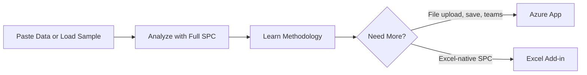

# PWA (Free Training Tool)

> **Role**: Free SPC training and education tool for quality professionals, students, and developing countries.
>
> Per [ADR-007](../../07-decisions/adr-007-azure-marketplace-distribution.md), the PWA provides free access to core analysis features. The [Azure App](../azure/index.md) adds file upload, save/persistence, Performance Mode, and team features.

---

## Purpose: Free Training & Education

The PWA is a **free SPC training tool** that provides:

1. **Core analysis for everyone** — I-Chart, Boxplot, Pareto, Capability, Regression, Gage R&R, ANOVA
2. **Pre-loaded case study datasets** — Same datasets as documentation
3. **Copy-paste from Excel/Sheets** — No file upload, paste data directly
4. **Zero friction** — No signup, no payment, no installation required



---

## Target Users

| User                  | Context                          | Why PWA Works                              |
| --------------------- | -------------------------------- | ------------------------------------------ |
| **LSS Trainers**      | Green Belt / Black Belt courses  | Minitab replacement with zero installation |
| **Students**          | University statistics courses    | Free, browser-based, no license needed     |
| **Quality Champions** | SMEs in developing countries     | Better tools than Excel, completely free   |
| **Evaluators**        | Assessing VariScout capabilities | Try with sample data before purchasing     |

---

## Pre-Loaded Case Studies

The PWA comes with datasets from the documentation case studies:

| Dataset       | Case Study                                                  | Demonstrates             |
| ------------- | ----------------------------------------------------------- | ------------------------ |
| Coffee        | [Coffee Case](../../04-cases/coffee/index.md)               | Factor comparison, MSA   |
| Bottleneck    | [Bottleneck Case](../../04-cases/bottleneck/index.md)       | Process flow, drill-down |
| Hospital Ward | [Hospital Ward Case](../../04-cases/hospital-ward/index.md) | Aggregation trap         |
| Packaging     | [Packaging Case](../../04-cases/packaging/index.md)         | Pareto, capability       |

**Learning continuity**: The same data appears in docs, PWA, and teaching materials.

---

## Features (Free)

All core SPC analysis features:

- I-Chart, Boxplot, Pareto, Capability Histogram
- Regression analysis, Gage R&R, ANOVA
- Drill-down with breadcrumb navigation
- Linked filtering across charts
- Data input: copy-paste from Excel/Sheets + sample datasets
- VariScout branding on charts

---

## Restrictions (Free Tier)

| Feature                 | PWA (Free)   | Azure App (Paid) |
| ----------------------- | ------------ | ---------------- |
| File upload (CSV/Excel) | -            | ✓                |
| .vrs import/export      | -            | ✓                |
| Save/persistence        | Session only | OneDrive sync    |
| Performance Mode        | -            | ✓                |
| Branding on charts      | Always shown | Hidden           |
| Authentication          | None         | Microsoft SSO    |
| Team collaboration      | -            | Shared projects  |

---

## Use Cases

| Use Case                 | Appropriate | Notes                              |
| ------------------------ | :---------: | ---------------------------------- |
| SPC training courses     |      ✓      | Full Green Belt coverage           |
| University education     |      ✓      | Free, no license needed            |
| Try case study data      |      ✓      | Pre-loaded datasets                |
| Analyze own data (paste) |      ✓      | Copy-paste from Excel              |
| Demo to stakeholders     |      ✓      | No setup required                  |
| **Production use**       |      ✗      | Use [Azure App](../azure/index.md) |
| **Team collaboration**   |      ✗      | Use Azure App with OneDrive        |
| **File upload**          |      ✗      | Use Azure App                      |
| **Data persistence**     |      ✗      | Session only (no save)             |

---

## Technical Stack

| Component | Technology               |
| --------- | ------------------------ |
| Framework | React 18 + TypeScript    |
| Build     | Vite                     |
| Styling   | Tailwind CSS             |
| Charts    | Visx (@variscout/charts) |
| State     | React Context            |
| Offline   | Service Worker           |

---

## Architecture

```
┌─────────────────────────────────────────────────────────────────┐
│                         USER'S BROWSER                          │
├─────────────────────────────────────────────────────────────────┤
│  ┌─────────────────────────────────────────────────────────────┐ │
│  │                    REACT APPLICATION                         │ │
│  │   DataContext → Charts → Analysis                           │ │
│  └─────────────────────────────────────────────────────────────┘ │
│                                                                  │
│  ┌─────────────────────────────────────────────────────────────┐ │
│  │                   Service Worker (offline)                   │ │
│  └─────────────────────────────────────────────────────────────┘ │
└──────────────────────────────────────────────────────────────────┘
```

---

## Development Commands

```bash
# Start development server
pnpm dev

# Build for production
pnpm build

# Run tests
pnpm --filter @variscout/pwa test
```

---

## Role in Development Workflow

The PWA serves as the **feature development sandbox**:

1. **New features** are prototyped in the PWA first
2. **Shared packages** are developed against PWA use cases
3. **Azure App** adopts features after PWA validation
4. **Excel Add-in** adapts features for Office.js constraints

---

## Upgrade Path

| Ready For...             | Next Step                                                 |
| ------------------------ | --------------------------------------------------------- |
| File upload, save, teams | [Azure App](../azure/index.md) (€150/month, all features) |
| Excel-native SPC         | [Excel Add-in](../excel/index.md) (FREE, core SPC charts) |

---

## See Also

- [Azure App (Primary Product)](../azure/index.md) - Production platform
- [Excel Add-in](../excel/index.md) - Excel-native option
- [Feature Parity](../feature-parity.md) - Platform comparison
- [ADR-007: Distribution Strategy](../../07-decisions/adr-007-azure-marketplace-distribution.md)
- [ADR-004: Offline-First](../../07-decisions/adr-004-offline-first.md)
